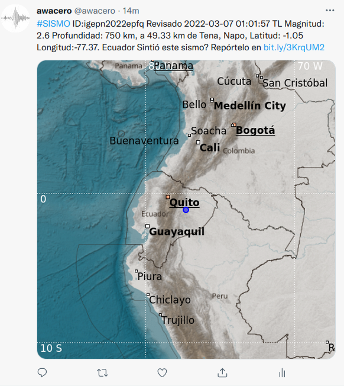

# igtwitter
GDS service to publish seismic information using a twitter account. This code was previously a plugin of EQEVENTS, but that code was modified to be used with GDS. 

The files send_igtwitter.cfg and twitter_account.json must be configured before running. 

GDS or the operator will decide wheter or not the tweet must be posted. There will be one tweet for the automatic (preliminar) event and another for the manual (revisado) event. If the event is older than hour_limit, there will be no publication. 


## Requirements
Install the following libraries as user modules
``` bash
$ python3 -m pip install --user ig_gds_utilities  
$ python3 -m pip install --user tweepy  

This package is required to check sqlite database from Linux bash
# apt install sqlite3  
```

## Result
If the publication works as expected, this should be posted in the twitter account. 


